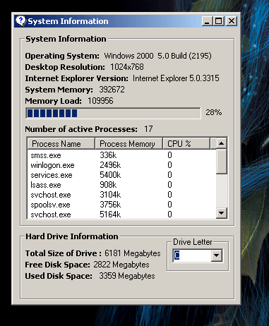



## System Information/Process Class 1\.2

### Description

This re-work of a previous submission now includes active memory load and system processes!

The code currently only works in this state under any NT based system above NT 4! It is all contained within a class object which can be exported and re-used in other projects.

If you like please do vote!
 
### More Info
 
Does not currently work on Win9x machines.

             |
---                |---
**Submitted On**   |2001-10-03 19:43:56
**By**             |[John Bridle](https://github.com/Planet-Source-Code/PSCIndex/blob/master/ByAuthor/john-bridle.md)
**Level**          |Intermediate
**User Rating**    |5.0 (20 globes from 4 users)
**Compatibility**  |VB 4\.0 \(32\-bit\), VB 5\.0, VB 6\.0, VBA MS Access
**Category**       |[Windows API Call/ Explanation](https://github.com/Planet-Source-Code/PSCIndex/blob/master/ByCategory/windows-api-call-explanation__1-39.md)
**World**          |[Visual Basic](https://github.com/Planet-Source-Code/PSCIndex/blob/master/ByWorld/visual-basic.md)
**Archive File**   |[System\_Inf14018310320\.zip](https://github.com/Planet-Source-Code/john-bridle-system-information-process-class-1-2__1-39490/archive/master.zip)

